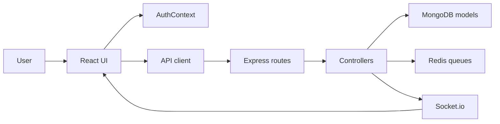

# ShiftFlow - Shift Management Software

ShiftFlow is a shift management app for teams that need to plan work, track attendance, handle leave requests, manage shift swaps, and review operational reports from one place.

## What this project does

The backend is an Express + MongoDB API and the frontend is a React + TypeScript app. Users sign in, land in a role-aware dashboard, and then work through the main operational flows:

- employees can view schedules, clock in and out, request leave, and request swaps
- managers and admins can create and update shifts, review attendance, approve or reject leave and swaps, view reports, and see team activity
- notifications are delivered through the API and refreshed in the UI, with socket rooms used for live attendance updates

This makes the app useful anywhere a team works in shifts, such as retail, hospitality, healthcare, logistics, support centers, and office operations with scheduled coverage.

No sample or demo records are bundled with the repository.

## How it works

The app is split into three layers:

1. `backend/src/server.js` starts the API, connects MongoDB and Redis, loads background jobs, and wires Socket.io.
2. `frontend/src/main.tsx` boots the React app, and `frontend/src/App.tsx` defines the routes and access control.
3. The shared auth state lives in `frontend/src/context/AuthContext.tsx`, which stores the token, user profile, and socket subscription state.

The backend exposes REST routes under `/api/v1/*`. The frontend uses those routes through `frontend/src/utils/api.ts`, which automatically attaches the JWT from local storage.



## User flow

1. A user registers or logs in through `/login`, `/signup`, `/forgot-password`, or `/reset-password/:token`.
2. After login, the app stores the token and user in local storage, then connects to the socket server and joins user, department, and role rooms.
3. The layout checks auth state and renders the main shell with the sidebar, header, notifications, and the current page.
4. RoleGate protects route access so that admin and manager screens stay hidden from regular employees.
5. Attendance changes update in real time through socket events like `attendance:clock-in` and `attendance:clock-out`.

## Roles and access

- `employee`: personal schedule, attendance, leave requests, swap requests, profile, and settings
- `manager`: everything an employee can do plus team scheduling, employee management, reports, and approval workflows
- `admin`: everything a manager can do plus broader management actions like payroll-style reporting and user deletion

## Main backend areas

- `backend/src/routes/auth.js`: register, login, logout, token refresh, password reset, and 2FA endpoints
- `backend/src/routes/users.js`: view and update users, with admin-only delete
- `backend/src/routes/employees.js`: employee records, availability, create/update/delete, and list access for authenticated users
- `backend/src/routes/shifts.js`: shift list, details, create/update/cancel, and conflict checks
- `backend/src/routes/attendance.js`: clock in/out, breaks, active attendance, status, and history
- `backend/src/routes/leaves.js`: request leave, review leave, approve, reject, update, and delete
- `backend/src/routes/swaps.js`: create swap requests, peer response, manager review, and cancellation
- `backend/src/routes/reports.js`: attendance, schedule, leave, and payroll exports for managers and admins
- `backend/src/routes/notifications.js`: list notifications, mark read, mark all read, delete, and clear read items
- `backend/src/routes/analytics.js`: dashboard KPIs, attendance trends, labor cost, employee performance, and coverage summaries

## Main frontend areas

- `frontend/src/components/Layout.tsx`: authenticated app shell
- `frontend/src/components/Sidebar.tsx`: navigation, filtered by role
- `frontend/src/components/Header.tsx`: user menu, notifications, and quick actions
- `frontend/src/pages/Dashboard.tsx`: role-aware landing page
- `frontend/src/pages/Schedule.tsx`: shift calendar, filters, create, and reassign flows
- `frontend/src/pages/Employees.tsx`: staff list, live attendance indicators, and invite flow
- `frontend/src/pages/Attendance.tsx`: clock in/out and attendance history
- `frontend/src/pages/Leaves.tsx`: leave request submission and approval/rejection
- `frontend/src/pages/Swaps.tsx`: swap request workflow and review stages
- `frontend/src/pages/Reports.tsx`: fetch and export reports as JSON, CSV, XLSX, or PDF
- `frontend/src/pages/Profile.tsx`: personal profile editing
- `frontend/src/pages/Settings.tsx`: theme and notification preferences

## API and realtime behavior

The frontend sends requests through `frontend/src/utils/api.ts`, which reads `VITE_API_URL` or falls back to `http://localhost:5000/api/v1`. When a user is authenticated, the token is attached as a Bearer token.

Socket behavior comes from `frontend/src/utils/socket.ts`. The client joins rooms for the user id, department, and role, and the backend emits attendance updates into those rooms so relevant screens can update without a manual refresh.

## Data model

The core entities are:

- `User`: login, role, preferences, 2FA, and security state
- `Employee`: HR-style profile data, skills, certifications, and availability
- `Shift`: title, time window, employee assignment, status, type, and recurrence fields
- `Attendance`: clock-in/out, break tracking, hours, and status
- `Leave`: leave type, date range, approval state, and review notes
- `Swap`: request, peer response, manager review, and completion state
- `Notification`: message delivery and read state

## Data relationships and persistence

MongoDB is the persistent source of truth for the application. The backend uses Mongoose relationships to connect the collections, and the controllers populate those links when reading data for the UI.

- `User` is the parent identity record for login, role, and preferences.
- `Employee` links back to `User` with a required `user` reference.
- `Shift` links to `Employee` and also records `createdBy` and `updatedBy` users.
- `Attendance` links to both `Employee` and `Shift` so the app can show who worked which shift.
- `Leave` links to `Employee` and approval users.
- `Swap` links the requester employee, the other employee, and the related shifts.
- `Notification` links to a `User` recipient so the header and socket-driven updates can stay user-specific.

That structure keeps the data consistent across the schedule, attendance, leave, swap, and reporting screens instead of storing isolated records with no cross-links.

## How it is used

The app is used as a daily operations tool rather than a static admin dashboard. A typical team uses it to:

- schedule people into shifts for the week
- record attendance at the start and end of work
- react to leave requests before coverage breaks
- negotiate shift swaps between employees and supervisors
- review team performance, attendance, and coverage gaps

Because the pages are role-aware, the same system can support both frontline employees and the managers who coordinate them.

## Screen walkthrough

- `Login` and `Signup`: create or access an account, then land in the authenticated app shell.
- `Dashboard`: gives each role a shortcut hub; managers and admins see operational metrics while employees see task-focused actions.
- `Schedule`: shows the shift calendar, filters the visible list, and lets managers or admins create and reassign shifts.
- `Employees`: lists staff, shows live attendance status, and exposes the invite flow.
- `Attendance`: lets employees clock in and out and review their attendance history.
- `Leaves`: lets employees submit leave requests and lets managers or admins approve or reject pending items.
- `Swaps`: lets employees request shift swaps and walk those requests through peer and manager review.
- `Reports`: lets managers and admins fetch or export attendance, schedule, leave, and payroll-style reports.
- `Profile` and `Settings`: let the logged-in user update personal details and preferences.

## Setup

### Requirements

- Node.js 20+
- npm
- MongoDB
- Redis

### Install

```bash
cd backend
npm install

cd ../frontend
npm install
```

### Configure environment

Set the backend environment variables used by the code:

```env
NODE_ENV=development
PORT=5000
MONGODB_URI=mongodb://localhost:27017/shiftflow
FRONTEND_URL=http://localhost:5173
API_VERSION=v1

JWT_SECRET=your_secret
JWT_REFRESH_SECRET=your_refresh_secret
JWT_EXPIRE=15m
JWT_REFRESH_EXPIRE=7d

REDIS_URL=redis://localhost:6379
ENABLE_CRON_JOBS=true
```

Set the frontend values used by Vite:

```env
VITE_API_URL=http://localhost:5000/api/v1
VITE_API_WS_URL=http://localhost:5000
```

### Run locally

```bash
# backend
cd backend
npm run dev

# frontend
cd frontend
npm run dev
```

## Available scripts

### Backend

- `npm run start` starts the API
- `npm run dev` starts the API with nodemon and `.env.development`
- `npm run test` runs Jest
- `npm run lint` lints the backend source

### Frontend

- `npm run dev` starts the Vite dev server
- `npm run build` type-checks and builds for production
- `npm run lint` runs ESLint
- `npm run preview` serves the built app locally

## Project structure

```text
Shift-management-software/
├── backend/
│   └── src/
│       ├── config/
│       ├── controllers/
│       ├── jobs/
│       ├── middleware/
│       ├── models/
│       ├── routes/
│       ├── utils/
│       └── server.js
└── frontend/
    └── src/
        ├── components/
        ├── context/
        ├── pages/
        ├── types/
        ├── utils/
        ├── App.tsx
        └── main.tsx
```

## Notes

This README now matches the code in the repository instead of the earlier template content. No fixture data is bundled in the repository.
